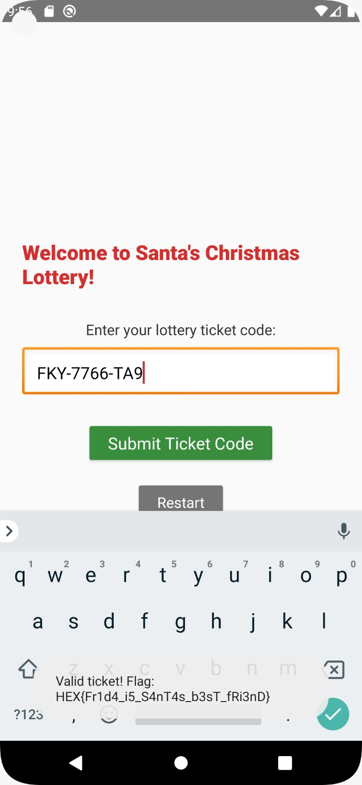

### chall name: Christmas Lottery
hex advent day 12   
   
we are given an apk: christmas-lottery.apk  
  
first i decompiled the apk with jadx  
from com/christmas/lottery/christmaslottery and mainactivity, and some other helper functions, heres what the flow looks like:  
```
signInAnonymously()
    ↓
receive Firebase uid
    ↓
get id token (jwt containing uid)
    ↓
POST /init with idToken
    ↓
backend flow(i think??):
    1. verify jwt signature
    2. extract uid from token
    3. generate/retrieve seed for this UID
    4. return seed 
    ↓
store seed in MainActivity.secretSeed  
    ↓
generate ticket  
```
  
didnt realise the android app dev stuff in sch wld ever be helpful but yay ig    
  
but also uh i didnt know about frida which is:  
'In cybersecurity, **Frida** is a powerful, open-source **dynamic instrumentation toolkit** that lets security researchers and developers inject JavaScript or their own libraries into running applications (on Windows, macOS, Android, iOS, etc.) to inspect and modify their behavior in real-time'  
  
basically, this is how to setup:  
run app apk with emulator in android studio  
  
on host:  
``` sh 
adb push frida-server /data/local/tmp/
adb root
adb shell
```
  
in the shell:  
``` sh 
cd /data/local/tmp
chmod 755 frida-server
./frida-server &
```
  
on host:   
``` sh
frida -U -f com.christmas.lottery -l script.js
```
  
script to:  
hook into the app at runtime,  
intercept the random seed used,  
then recreate the same ticket generation logic  
``` js
Java.perform(function () {    
    function generateTicket(seed) {
        // beautifully translated code by deepseek 
        var alphabet = "ABCDEFGHJKLMNPQRSTUVWXYZ";
        var digits = "0123456789";
        var ticket = [];
        
        for (var i = 0; i < 3; i++) {
            var index = (seed >> (i * 3)) % 24;
            ticket.push(alphabet.charAt(index));
        }
        ticket.push('-');
        
        for (var i = 0; i < 4; i++) {
            var index = (seed >> ((i * 4) + 9)) % 10;
            ticket.push(digits.charAt(index));
        }
        ticket.push('-');
        
        for (var i = 0; i < 2; i++) {
            var index = (seed >> ((i * 5) + 25)) % 24;
            ticket.push(alphabet.charAt(index));
        }
        
        var code = ticket.join('').replace(/-/g, '');
        var sum = 0;
        for (var i = 0; i < code.length; i++) {
            var c = code.charAt(i);
            if (c >= '0' && c <= '9') {
                sum += parseInt(c);
            } else {
                sum += c.charCodeAt(0) - 64;
            }
        }
        ticket.push(digits.charAt(sum % 10));
        
        return ticket.join('');
    }
    
    var JSONObject = Java.use("org.json.JSONObject");
        
    JSONObject.getLong.overload('java.lang.String').implementation = function(key) {
        var x = this.getLong(key);
        
        if (key === "seed") {
            var seedStr = x.toString();
            
            console.log("seed: " + x);
                var ticket = generateTicket(x);
                console.log("ticket: " + ticket);
        }
        
        return x;
    };
});
```
  
then input the ticket, and on success, u get toast with flag heheh  
  
