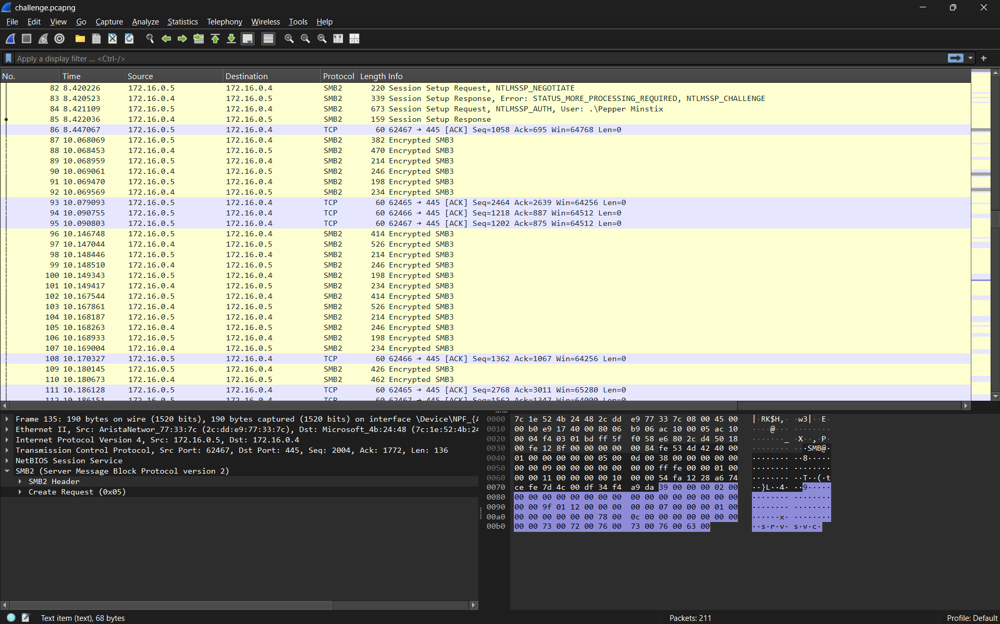
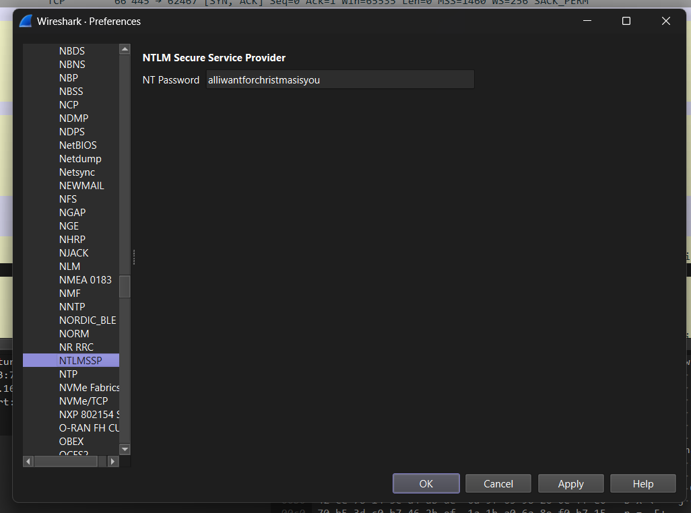
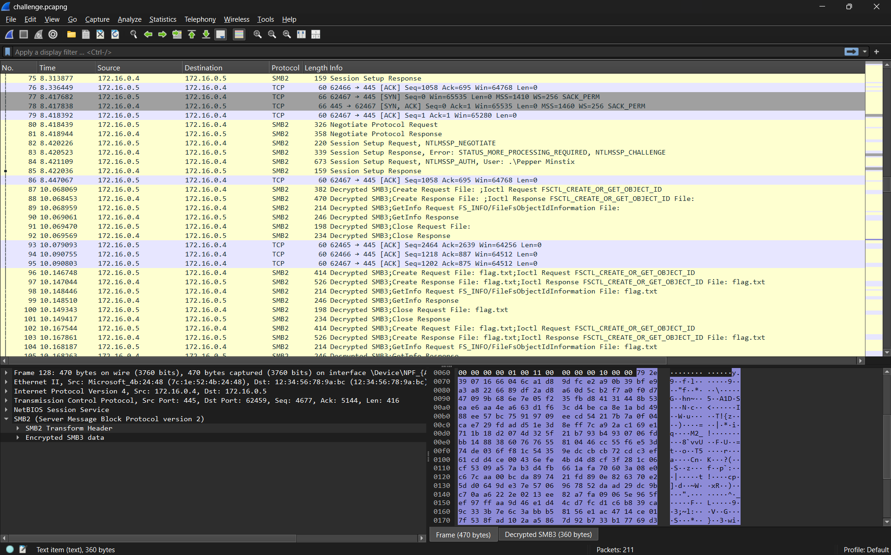

### chall name: Santa’s Message  
hex advent day 7  
  
source: `challenge.pcapng`  
   
generally if i see a pcap i run in the other direction, but also like theres only 12 challenges in this ctf and you kinda need 10 to 'win' in any sense so i dont have many choices. additionally, this challenge is labelled 'easy'...  
  
challenge description:    
`Help Santa's elf recover Santa's secret message!`  
   
well that was not remotely informative or helpful :c  
  
  
  
directly opening the pcapng, we just see a some smb stuff and whatnot, transparently (DISCLAIMER!!) i dont fully understand the ins and outs of networking but it connected to like 4 ports and theres some auth using ntlm and then sending some data over smb protocol, which i had not heard of prior to this challenge  
  
thankfully google exists and i found [this](https://medium.com/@AT24/block-ctf-walkthrough-thm-88c28ca85189) which wasnt actually that helpful in this case cos we arent provided with the `.DMP` thing but i guess i kinda got an idea of smb and how the ntlm auth works  
  
and so i found [this](https://medium.com/maverislabs/decrypting-smb3-traffic-with-just-a-pcap-absolutely-maybe-712ed23ff6a2)after looking specifically for decrypting given only the traffic and that basically describes exactly how to solve this challenge. 
however, after you crack the password with `hashcat`, dont follow the calculate session key thing, i tried and it didnt work and i wasted a bunch of time :(  
  
instead, take that password, go preferences -> protocols -> NTLMSSP, and input it into `nt password`  
  
   
  
yay, now the encrypted packets are decrypted!
  
  
  
and so when we file -> export objects -> smb...   
   
we see a flag!  
    
`HEX{3lVe5_uS3_1Ns3cUR3_P@$$w0rd5}`
